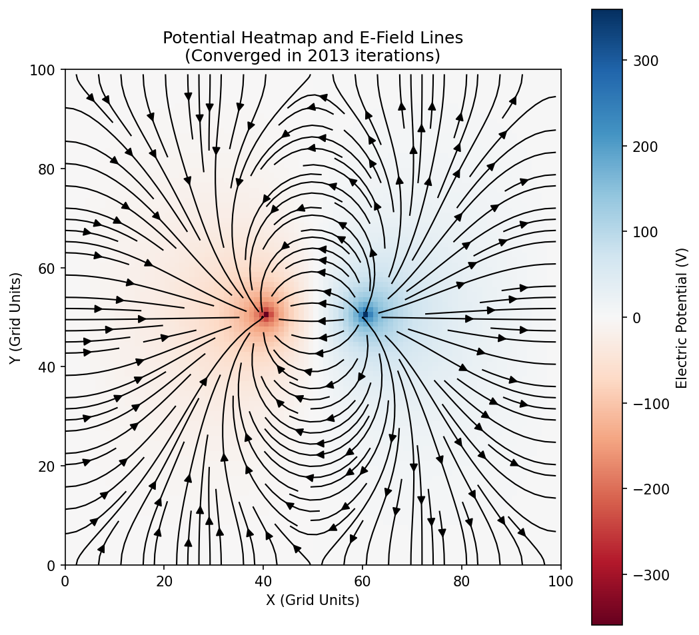
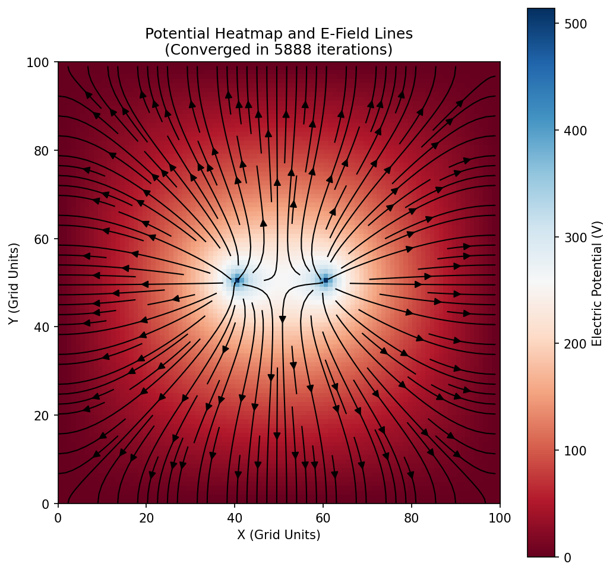
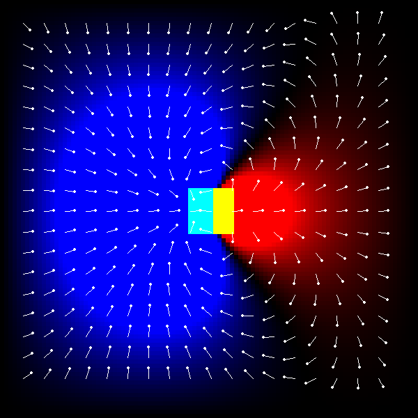
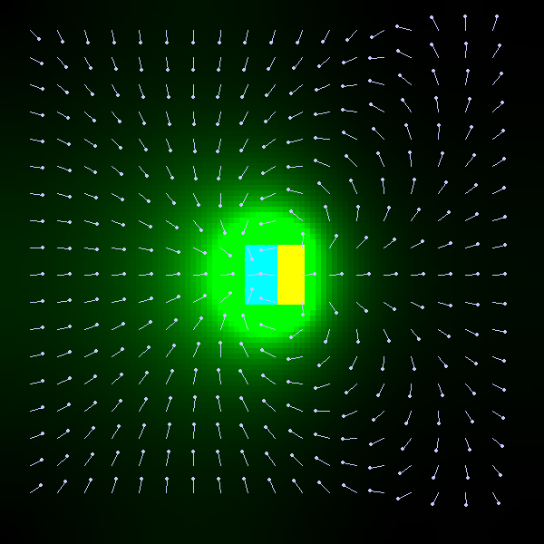

# Electrostatics Simulator

Welcome to the Electrostatics Simulator! This project is a 2D computational environment designed to solve and visualize electric potential and electric field lines for any custom charge distribution you want to create.

Whether you want to experiment interactively or run mathematically precise calculations, there are two modes you can explore:

1. **Interactable Mode (Pygame)**: An interactive real-time sandbox. You can paint charges directly onto the grid with your mouse and watch the potential field settle into equilibrium live at 60 FPS.
2. **Analytic Mode (Matplotlib)**: A precise numerical solver. It iterates until the entire field reaches a strict mathematical convergence limit, generating clean heatmaps and streamline vector plots of the electric field.

Feel free to dive into `main.py`, modify the density functions, and test out your own electrostatics configurations!

---

## Sample Results

### Analytic Solver Output

*Electric Dipole (+q, -q)*


*Same Charge Pair (+q, +Q)*


### Real-Time Pygame Output (Dipole)
*Potential Heatmap (Left) and E-Field Magnitude (Right)*

<p align="center">
  
  
</p>

---

## How It Works: The Mathematics

Understanding the physics under the hood makes experimenting even more fun. Here is how the simulator computes fields from charge distributions:

### 1. Poisson's Equation
In electrostatics, the electric potential $V$ at any point in space relates directly to the charge density $\rho$ via Poisson's Equation:

$$
\nabla^2 V = -\frac{\rho}{\epsilon_0}
$$

For simplicity and numerical stability, we set $\epsilon_0 = 1$, which simplifies the equation in two dimensions to:

$$
\frac{\partial^2 V}{\partial x^2} + \frac{\partial^2 V}{\partial y^2} = -\rho
$$

### 2. The Jacobi Method (Numerical Solver)
To solve this equation on a discrete 2D grid, we use finite differences. By approximating the derivatives using neighboring grid cells, we arrive at the Jacobi iteration formula:

$$
V_{i,j} = \frac{1}{4}(V_{i+1,j} + V_{i-1,j} + V_{i,j+1} + V_{i,j-1} + \rho_{i,j})
$$

Think of this as a relaxation technique. In each step, every cell updates to become the average of its four neighbors plus local charge contributions. Over multiple iterations, errors smooth out until the grid naturally converges to the steady-state potential field.

### 3. The Electric Field
The electric field $\mathbf{E}$ is defined as the negative gradient of the potential field $V$:

$$
\mathbf{E} = -\nabla V
$$

Once we have calculated the potential $V$, we compute spatial derivatives in the X and Y directions to determine the direction and magnitude of the electric field everywhere on the grid.

---

## Try It Yourself: Starter Density Functions

To help you get started, here are a few fun configurations you can try. Simply open `main.py` and replace `density_function(x, y)` with any of these snippets, or write your own custom mathematical functions!

### 1. Point Charge
A single localized point of charge.
```python
def point_charge(x: int, y: int) -> float:
    return 1000.0 if (x == 50 and y == 50) else 0.0
```

### 2. Electric Dipole
Two equal but opposite charges separated by a short distance.
```python
def electric_dipole(x: int, y: int) -> float:
    if x == 40 and y == 50:
        return -100.0
    elif x == 60 and y == 50:
        return 100.0
    return 0.0
```

### 3. Infinite Line Charge
A continuous straight line of uniform charge density.
```python
def line_charge(x: int, y: int) -> float:
    return 100.0 if x == 50 else 0.0
```

### 4. Parallel Plate Capacitor
Two parallel plates with opposite charges, creating a uniform field between them.
```python
def parallel_plates(x: int, y: int) -> float:
    if x == 30 and 20 <= y <= 80:
        return -100.0
    elif x == 70 and 20 <= y <= 80:
        return 100.0
    return 0.0
```

Have fun experimenting with your own shapes, mathematical formulas, and charge setups!
